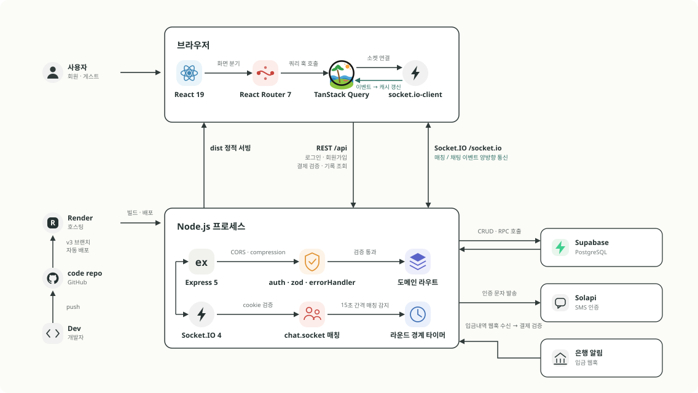

# 텔레파시

> 관심 단어 기반 랜덤채팅 서비스

15초의 한 턴 안에 같은 단어를 고른 사용자끼리 실시간으로 연결됩니다.

| 구분 | 내용                |
| ---- | ------------------- |
| 기간 | 2026.07 ~           |
| 인원 | 개발 1인 · 기획 1인 |
| 상태 | 개발 중             |

[사이트 이동하기](https://telepathy.my/) · [관련 뉴스](https://platum.kr/archives/272577) · [GitHub](https://github.com/MoonEunSeo/telepathy-app/tree/v3)

기획자가 AI 코딩 도구로 만들어 운영하던 서비스로, 2026년 7월부터 개발을 단독으로 맡고 있습니다. 저장소는 기획자 계정에 있으며, 7월 이후 커밋이 담당한 작업입니다.

기획자로부터 넘겨받은 JavaScript 코드베이스를 TypeScript로 마이그레이션하며, 실시간 매칭·채팅부터 인증·결제까지 프론트엔드와 백엔드를 함께 맡고 있습니다. 화면 디자인은 Claude Design으로 직접 진행했습니다.

## 기술 스택

`React 19` · `TypeScript` · `Vite` · `TanStack Query` · `React Hook Form` · `Tailwind CSS v4` · `Socket.IO Client` · `Express 5` · `Supabase / PostgreSQL` · `Render`

## 시스템 아키텍처

---

## 로딩 성능

### 웹폰트 자체 호스팅

#### 문제

`fonts.googleapis.com`에서 CSS를 받고, 거기 적힌 주소를 따라 `fonts.gstatic.com`에서 woff2를 받고 있었습니다. 오리진 두 곳에 각각 DNS·TCP·TLS가 필요했고 LCP는 3.4초였습니다.

앞선 코드 스플리팅 작업에서 이 외부 의존이 측정을 망친 적이 있습니다. Lighthouse 점수가 회차마다 12~15점씩 갈렸는데, 원인은 외부 폰트 응답 편차 470 ms였고 그 변경으로 얻은 개선폭 299 ms보다 컸습니다. 그때는 폰트 오리진을 차단해 측정만 우회했습니다.

#### 접근

처음에는 `preload`로 폰트를 앞당기려 했습니다. 그런데 재보니 폰트는 이미 첫 페인트 전에 도착하고 있어 앞당길 여지가 없었습니다. 남은 비용은 파일 자체가 아니라 오리진 두 곳에 연결하는 과정이었고, 그렇다면 파일을 우리 서버에서 주는 수밖에 없었습니다.

용량도 확인했습니다. 세 폰트를 전부 받으면 2.92 MB입니다. 쓰는 글자만 골라 한 파일로 묶는 정적 서브셋을 검토했지만 이 서비스에는 쓸 수 없었습니다. 채팅이라 사용자가 무슨 글자를 칠지 미리 알 수 없고, 빠진 글자는 시스템 폰트로 떨어져 한 문장 안에서 글꼴이 섞이기 때문입니다.

#### 해결

woff2 196개를 저장소에 넣고 `@font-face`를 직접 선언했습니다.

- unicode-range 분할은 그대로 옮겼습니다. 한글은 표현 가능한 글자가 11,172자라 한 파일에 담으면 1.5 MB입니다. 글자 범위별 95조각 구조를 유지하면 브라우저가 화면에 실제로 그리는 글자가 속한 조각만 받으므로, 전체 2.92 MB 중 첫 화면은 137.8 kB만 내려받습니다.
- woff2 인라인은 금지했습니다. 4 kB 미만 서브셋 3개가 Vite 기본 설정으로는 base64가 되어 렌더 차단 CSS 안에 박힙니다. 용량이 33% 부풀고 조각으로 나눈 의미도 사라집니다.
- 세 폰트 모두 SIL OFL 1.1이라 재배포와 웹 임베딩이 허용되는 것을 확인하고 `OFL.txt`를 함께 두었습니다.

| 지표 | Before | After | 차이 |
| --- | ---: | ---: | ---: |
| LCP | 3,442 ms | **2,266 ms** | **−34.2%** |
| FCP | 3,353 ms | **1,953 ms** | **−41.8%** |
| Speed Index | 4,580 ms | **1,953 ms** | **−57.4%** |
| 성능 점수 | 82 | **97** | +15 |
| 5회 측정 점수 편차 | 15점 | **2점** | |

측정을 흔들던 원인이 사라지면서 점수 편차도 15점에서 2점으로 떨어졌습니다.

### 라우트 코드 스플리팅

#### 문제

`App.tsx`가 페이지 컴포넌트 19개를 전부 정적으로 import하고 있었습니다. 정적 import는 "이 파일이 필요하다"가 아니라 "이 파일을 번들에 넣어라"입니다. 결과는 단일 번들 547.8 kB였고 Vite도 500 kB 초과 경고를 내고 있었습니다. 로그인 화면 하나를 보려고 채팅·결제·약관 코드까지 받는 셈이었습니다.

#### 접근

쪼개기 전에 무엇이 번들을 차지하는지부터 셌습니다. 소스맵의 `mappings`를 해석해 생성된 바이트를 원본 모듈에 귀속시켰습니다. 소스 글자 수로 세면 주석과 개발용 코드가 섞여 왜곡되는데, 실제로 같은 번들을 글자 수로 세면 `react-router`가 22.0%로 나오지만 생성 바이트 기준으로는 7.9%였습니다.

이렇게 세어보니 `axios`가 8.8%를 차지하는데 쓰는 곳은 첫 화면이 아닌 3개 파일뿐이었습니다. 반대로 `socket.io`는 비중이 비슷해도 메인 화면이 쓰고 있어 첫 화면에서 뺄 수 없었습니다.

#### 해결

`SplashScreen`만 남기고 19개 라우트를 `lazy`로 바꾼 뒤 `Routes`를 `Suspense`로 감쌌습니다.

- 진입 화면인 `SplashScreen`은 초기 번들에 남겼습니다. 쪼개면 이것 하나 받으려고 왕복이 한 번 더 생겨 첫 페인트가 오히려 늦어집니다.
- `ToastContainer`는 `Suspense` 밖에 두었습니다. 안에 넣으면 라우트 청크를 받는 동안 토스트도 함께 사라집니다.

| 지표 | Before | After | 차이 |
| --- | ---: | ---: | ---: |
| 초기 로드 JS (gzip) | 170,915 B | **111,495 B** | **−34.8%** |
| 압축 전 | 547,820 B | 347,140 B | −36.6% |
| 청크 수 | 1개 | 30개 | |

### 이미지 자산 재인코딩

#### 문제

서버 응답 압축으로 첫 로드 전송량을 70.4% 줄였는데, 같은 압축이 이미지에는 4%밖에 듣지 않았습니다. 남은 이미지 자산이 1.4 MB였습니다.

#### 접근

PNG는 DEFLATE, JPEG는 DCT, WebP는 자체 알고리즘으로 파일을 만들 때 이미 압축돼 있습니다. 압축된 데이터에는 반복 패턴이 남아 있지 않으니 전송 압축을 한 번 더 걸어도 줄어들지 않습니다. 전송 단계에서 할 수 있는 게 없어 이미지 자체를 열어봤고, 자산 5건에서 원인이 셋으로 나뉘었습니다.

- **내용에 맞지 않는 포맷** — 흑백 2색 QR이 JPEG로, 사진 계열 목업이 24비트 PNG로 저장돼 있었습니다. 손실 포맷에 선명한 경계를 넣으면 아티팩트가 생기고, 무손실 포맷에 사진을 넣으면 압축이 되지 않습니다.
- **과대 해상도** — 16 px로 그릴 파비콘에 1633 px 이미지가 들어 있었습니다.
- **래스터를 SVG로 감쌈** — `favicon.svg`와 테마 배경 둘 다 확장자만 SVG고 내용은 base64로 인코딩한 PNG·JPEG였습니다. base64는 3바이트를 4글자로 바꾸므로 정확히 +33.3%가 붙습니다. 벡터의 이점은 얻지 못한 채 비용만 늘어난 상태였습니다.

#### 해결

파비콘은 벡터 SVG로 다시 그리고, 나머지는 내용에 맞는 포맷으로 변환했습니다. 검증에는 스크린샷 대신 브라우저 canvas로 픽셀을 디코딩해 크기·색·알파를 수치로 남겼고, 결제 QR은 `jsQR`로 페이로드까지 대조해 스캔되는 이미지인지 확인했습니다.

| 자산 | Before | After |
| --- | ---: | ---: |
| 파비콘 (모든 방문) | 659,996 B | **1,150 B** |
| 테마 배경 | 358,228 B | **61,450 B** |
| OG 이미지 | 285,198 B | **72,420 B** |
| 프로필 이미지 · 결제 QR | 132,023 B | **7,230 B** |
| 합계 | 1,454 kB | **142 kB (−90.2%)** |

---

## 렌더링과 서버 상태

### 폼 타이핑당 리렌더

#### 문제

모든 폼이 입력값을 `useState`로 들고 있는 제어 컴포넌트였습니다. 글자 하나마다 상태가 바뀌고, 그때마다 컴포넌트와 자식(입력창·버튼·모달)이 다시 계산됐습니다.

#### 접근

실제로 몇 번 리렌더되는지 셌습니다. 폼 크기에 따른 차이를 보려고 가장 가벼운 폼(상태 5개)과 가장 무거운 폼(상태 9개)을 나눠 측정했고, 12글자 입력에 정확히 12 commit이 나왔습니다. 두 번 측정 모두 같았고, React DevTools의 "What caused this update?"가 원인을 해당 폼으로 지목해 추정이 아님을 확인했습니다.

전환 후 재측정할 때는 도구를 Profiler UI에서 `useEffect`(의존성 배열 없음) 카운터로 바꿨습니다. Profiler 패널은 페이지와 분리된 컨텍스트라 브라우저 자동화로 접근할 수 없기 때문입니다. `useEffect`는 commit마다 정확히 1회 실행되고 업데이트 commit에는 StrictMode 이중 실행이 없어, 세는 대상이 같으면서 오염되지 않습니다.

#### 해결

인증 폼 4종을 React Hook Form 비제어 방식으로 전환했습니다.

- 순수 전환 효과는 부수효과가 없는 비밀번호 필드에서 측정했습니다. 12번의 실제 `input` 이벤트에도 commit 카운터가 움직이지 않았습니다.
- 아이디 필드에 남은 `+1`은 글자당이 아니라 1회성이며, 원인이 RHF가 아니라 중복검사 무효화 로직임을 18글자까지 늘려 확인했습니다. 개선 후 남은 비용의 출처까지 분리해 두었습니다.
- 전환하면서 필드별 인라인 에러를 도입했습니다. 기존에는 모달 하나로 뭉뚱그려 어느 칸이 문제인지 알 수 없었습니다. `isSubmitting`으로 중복 제출을 막고, `<form>`을 도입해 Enter 제출과 비밀번호 관리자 인식이 되게 했습니다.

| 지표 | Before | After |
| --- | ---: | ---: |
| 글자당 리렌더 | 1.0회 | **0회** |
| 12글자 입력 시 총 commit | 12회 | **0회** |

### 서버 데이터 캐시

#### 문제

서버 데이터를 담아둘 캐시 계층이 없어, 페이지를 오갈 때마다 같은 데이터를 새로 받아왔습니다. 화면 전환 한 번에 API 요청이 15건 발생했습니다.

#### 접근

15건을 한꺼번에 줄이려 하지 않고, 무엇이 진짜 중복인지 먼저 나눴습니다.

- `auth/check`는 라우트가 바뀔 때마다 호출되고 있었는데, 인증 상태는 화면 이동으로 바뀌지 않으므로 처음 한 번이면 충분했습니다.
- `profile` · `word-history` · `megaphone-count`는 여러 화면이 각자 받아오고 있었습니다.
- `current-round`는 15초 라운드의 남은 시간을 맞추기 위한 의도된 폴링이라 캐시로 줄일 대상이 아니었습니다. 별도 과제로 분리했습니다.

캐시 가능한 네 개를 추린 뒤 다음 문제를 확인했습니다. 캐시를 쓰면 오래된 값이 보일 수 있다는 점입니다. 확성기를 사고도 '없음'으로 표시되거나, 로그인 직후 보호 화면에서 튕기는 상황이 생길 수 있었습니다.

#### 해결

TanStack Query로 공용 캐시를 만들고, 무효화 시점을 값이 바뀌는 순간으로 한정했습니다.

한번 받아온 데이터는 필요한 컴포넌트가 공용으로 쓰도록 하고, 캐시는 확성기 구매·발사, 로그인·로그아웃처럼 값이 실제로 바뀌는 시점에만 비웠습니다. 시간 기반으로 주기적으로 비우지 않았기 때문에 요청이 다시 늘어나지 않으면서도 오래된 값이 보이는 문제를 막을 수 있었습니다.

| 엔드포인트 | Before | After |
| --- | ---: | ---: |
| `auth/check` | 4회 | **1회** |
| `word-history` | 4회 | **1회** |
| `profile` | 2회 | **1회** |
| `megaphone-count` | 2회 | **1회** |
| 화면 전환 총 API 요청 | 15건 | **6건 (−60%)** |

### 경쟁 상태 차단

#### 문제

즐겨찾기 하트는 클릭할 때마다 낙관적 업데이트 후 PATCH를 보내는데, 취소나 직렬화가 없어 여러 요청이 동시에 떠 있었습니다. 화면은 마지막에 받은 데이터를 기준으로 반영되므로, 응답 도착 순서가 뒤집히면 화면과 DB가 달라집니다. 서버도 last-write-wins라 별도 방어가 없었습니다.

#### 접근

Fast 4G에서 6회 연타를 3회 반복했습니다. 요청은 클릭 수만큼 발생했고 Slow 4G에서는 6클릭의 요청이 3초 이상 겹쳐 있었지만, 화면과 DB의 불일치는 6회 중 0회로 재현되지 않았습니다. 역전 확률을 높이려고 Slow 4G로 조건을 바꿔 다시 쟀는데도 마찬가지였습니다.

재현되지 않았지만 방어는 필요하다고 봤습니다. 나오지 않은 이유는 요청 처리 시간이 균일했기 때문이고, 코드에는 순서를 보장하는 장치가 하나도 없었기 때문입니다.

#### 해결

`useMutation`으로 요청을 직렬화하고 롤백 방식을 바꿨습니다.

- 같은 카드의 수정 요청을 직렬화해, 최종값이 응답 도착 순서가 아니라 요청을 보낸 순서로 정해지게 했습니다.
- 저장에 실패하면 반대값을 계산하는 대신 변경 직전 스냅샷으로 되돌립니다. 연속 클릭 중에는 반대값이 실제 이전 값과 다를 수 있기 때문입니다.
- `onSettled`의 invalidate로 최종적으로 서버 값에 수렴시킵니다.

요청 수 자체는 줄이지 않았습니다. 6클릭에 6요청은 그대로이고, 이번에 해결한 것은 순서 보장입니다. 요청을 합치는 것은 별도 과제로 남겨 두었습니다.

---

## 디자인 시스템과 코드 품질

### CSS Modules 제거와 디자인 토큰

#### 문제

색상값이 전역 CSS·CSS Modules·인라인 스타일에 흩어져 있었습니다. 할로윈 테마는 개별 선택자로 색을 덮어쓰는 방식이라, 새 화면을 만들 때마다 덮어쓰기 누락이 생겼습니다.

#### 접근

유틸리티 클래스를 도입하면서 색상값을 그대로 하드코딩하면 흩어진 위치만 바뀝니다. 그래서 시맨틱 토큰을 먼저 정의해 단일 출처를 만들고, Tailwind가 그 토큰을 읽게 하는 순서로 잡았습니다. 이렇게 해야 테마가 토큰 값만 바꿔서 유틸리티까지 한 번에 반영할 수 있습니다.

Preflight도 검토했는데, 전면 리셋을 적용하면 기존 스타일이 한꺼번에 무너져 그대로 켤 수 없었습니다.

#### 해결

- `tokens.css`에 시맨틱 컬러 토큰을 정의하고 하드코딩된 색상을 치환했습니다.
- Tailwind v4의 `@theme inline`으로 기존 토큰을 자기참조 브리지했습니다. 그 결과 `body.halloween-mode` 런타임 오버라이드가 Tailwind 유틸리티 클래스까지 그대로 반영됩니다.
- Preflight는 제외하고, 실제로 문제가 된 항목(네이티브 button 테두리 등)만 `@layer base`로 선별해 리셋했습니다.
- 흩어진 전역 클래스를 공유 컴포넌트 6종(`Button` · `AuthInput` · `Modal` · `FieldMessage` · `TextLink` · `ToggleButton`)으로 추출했습니다. 색·애니메이션·테두리를 토큰에서 읽으므로 테마가 자동 반영됩니다.
- 전환은 화면 단위로 나눠 진행하고 매번 실제 브라우저로 시각 회귀를 확인했습니다. 최종적으로 CSS Modules를 완전히 제거했습니다(58파일, 순 −2,823줄).

### TypeScript 마이그레이션

#### 문제

넘겨받은 코드베이스가 JavaScript였고, 클라이언트와 서버가 같은 데이터의 형태를 각자 가정하고 있었습니다. 소켓 이벤트 페이로드처럼 양쪽이 맞춰야 하는 계약이 코드 어디에도 명시돼 있지 않았습니다.

#### 접근

변환 대상을 훑어보니 참조가 0건인 컴포넌트·페이지가 9개 있었습니다. 쓰지 않는 코드를 타입까지 붙여 옮길 이유가 없어 먼저 지웠습니다. 양쪽이 공유하는 값은 각자 타입을 선언하면 다시 어긋나므로, `shared/`로 모아 단일 출처로 두기로 했습니다.

#### 해결

- 프론트엔드 전체를 TSX로 전환하면서 죽은 코드 9개(−1,836줄)를 정리했습니다.
- 공유 계약 타입을 `shared/`로 이관했습니다. 이 과정에서 실제로 어긋나 있던 소켓 계약 타입 불일치를 찾아 고쳤습니다.
- `as` 캐스트로 덮어두는 대신 외부 경계에서 방어하도록 정리하고, Prettier·oxlint를 도입해 커밋 전 프론트·서버 양쪽 타입체크를 통과시키는 것을 규약으로 문서화했습니다.

### 한글 입력 환경에서만 재현되는 채팅 버그

#### 문제

한글로 대화할 때만 마지막 메시지가 두 번 전송되거나 두 번 표시됐습니다. 영문으로 테스트하면 나타나지 않았습니다.

#### 접근

브라우저가 실제로 몇 번의 이벤트를 주는지 세어봤습니다. 한글 "안녕"을 입력하고 Enter를 눌렀을 때 keydown이 2회, 영문은 1회 발생했습니다. 한글은 조합이 끝나는 시점에 keydown이 한 번 더 오는데, 이걸 그대로 전송 트리거로 받고 있었습니다. 원인은 채팅 로직이 아니라 IME 조합 이벤트였습니다.

중복 표시는 원인이 달랐습니다. 같은 메시지가 여러 경로로 도착하는데, 직전 1건만 비교하는 방식으로는 `[A, B, A]` 순으로 늦게 도착하는 중복을 놓쳤습니다.

#### 해결

- 전송은 `isComposing`·keyCode 229 가드로 조합 종료 keydown을 걸렀습니다. 같은 태스크 안에서의 재호출은 in-flight 락으로 한 번 더 막았습니다.
- 표시는 최근 20건 윈도우에서 `(보낸 사람, 시각, 내용)`이 같은 메시지를 버리도록 바꿨습니다.
- 남은 한계(같은 밀리초에 서로 다른 메시지 두 건이 오면 두 번째가 소실됨)는 사람이 타이핑하는 속도로는 발생하지 않지만, 자동 전송 기능을 추가할 때 재검토하도록 문서에 기록해 두었습니다.
