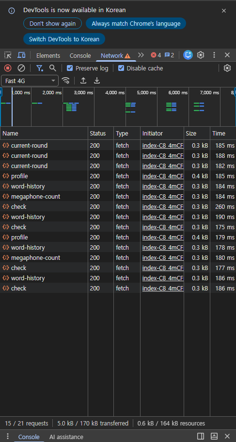

# S1. 화면 전환 시 중복 API 호출

> 측정 환경·원칙은 [README](../README.md) 참조. 조건: **Fast 4G / CPU 4x / production build**

## 대상 문제

각 컴포넌트가 `useEffect` 안에서 독립적으로 `fetch` 한다.
React에는 데이터 캐시가 없으므로 **페이지를 오갈 때마다 같은 데이터를 다시 받는다.**

```
MyPage 진입   → useEffect → word-history 요청 ①
MyWords 이동  → MyPage 언마운트, MyWords 마운트 → 요청 ②   ← 같은 데이터
MyPage 복귀   → 또 마운트 → 요청 ③                          ← 또 같은 데이터
```

각 컴포넌트가 서로의 존재를 모른 채 가져오고, 방금 받은 데이터를 **기억할 곳이 없다.**

### 호출 분산 현황 (코드 기준)

| 엔드포인트 | 호출하는 파일 |
|---|---|
| `/api/nickname/profile` | MyPage, MainPage, LikePage |
| `/api/word-history` | MyPage, MyWords |
| `/api/user/megaphone-count` | MyPage, MainPage |
| `/api/auth/check` | App(라우트 변경마다), session.ts |

## 측정 방법

```
(Network 기록 초기화) → /mypage → /mywords → /mypage → /mywords
```

각 단계마다 화면이 완전히 로드될 때까지 대기.

## 결과 (Before)

| 엔드포인트 | 호출 수 | 각 Time (ms) | 누적 (ms) |
|---|---|---|---|
| `word-history` | **4** | 184, 190, 178, 186 | 738 |
| `auth/check` | **4** | 260, 175, 177, 186 | 798 |
| `profile` | **2** | 185, 179 | 364 |
| `megaphone-count` | **2** | 184, 180 | 364 |
| `current-round` | 3 | 185, 188, 182 | 555 |
| **합계** | **15** (전체 21건 중 Fetch/XHR) | | **2,819** |

전송량: 5.0 kB (전체 170 kB)



## 핵심 지표

| 지표 | Before | After | 개선 |
|---|---|---|---|
| 총 API 요청 수 (S1 시나리오) | **15건** | **6건** | **−9건 (−60%)** |
| `word-history` 호출 수 | **4회** | **1회** | −3 |
| `auth/check` 호출 수 | **4회** | **1회** | −3 |
| `profile` 호출 수 | **2회** | **1회** | −1 |
| `megaphone-count` 호출 수 | **2회** | **1회** | −1 |
| `current-round` 호출 수 | 3회 | 3회 | 폴링(S6)이라 대상 아님 |
| 제거된 중복 요청 | — | **9건** | |

> `current-round`는 의도된 폴링이라 캐시 대상에서 제외 — [S6](../s6-polling/README.md)에서 별도 측정.
> 근본 해결은 소켓 push 이며 캐시로 줄지 않는다.

## 결과 (After)

TanStack Query 5.101 도입 후 재측정. 캐시 가능한 4개 엔드포인트를 공용 쿼리로 이관했다.

| 엔드포인트 | Before | After | 전환 방식 |
|---|---:|---:|---|
| `profile` | 2 | **1** | useProfile (queryKey `['profile']`) — MyPage·MainPage·LikePage 공유 |
| `word-history` | 4 | **1** | useWordHistory (`['wordHistory']`) — MyPage·MyWords 공유, 낙관적 업데이트는 setQueryData |
| `megaphone-count` | 2 | **1** | useMegaphoneCount (`['megaphoneCount']`) — MyPage(useQuery)·MainPage(fetchQuery), 구매·발사 시 invalidate |
| `auth/check` | 4 | **1** | useAuthCheck (`['authCheck']`) — 조회/가드 분리, 로그인·로그아웃·탈퇴 시 invalidate |
| `current-round` | 3 | 3 | 미전환 (폴링 → 소켓 push 대상) |
| **합계** | **15** | **6** | |

### 측정 방법 — 원 시나리오를 재현할 수 없었던 이유

Before 는 `/mypage → /mywords → /mypage → /mywords` 로 측정했으나, After 는 **이 경로를 재현하지 못했다.**
`/mypage`·`/mywords`·`/likes` 는 보호 라우트라 로그인이 필요하고, 자동화 측정 환경에서
자격증명을 입력할 수 없기 때문이다. 대신 **같은 dedup 메커니즘**을 두 방식으로 측정했다.

**① 클라이언트 라우팅 재방문 (공개 페이지 `/main`)**
URL 이동은 전체 새로고침이라 SPA 캐시가 초기화되므로, `history.pushState` + `popstate` 로
react-router 클라이언트 전환을 재현했다.

| 측정 | 결과 |
|---|---|
| `profile` — `/main` 6회 재방문 (main→help→main) | 캐시 off **6건** vs 캐시 on **1건** |
| `auth/check` — 클라이언트 라우트 10회 변경 | 재요청 **0건** (기존: 이동마다 1건) |

`profile` Before/After 는 매 재방문 직전 `queryClient.removeQueries` 로 캐시를 비워
전환 전(fetch-per-mount) 동작을 그대로 재현해 대조했다.

**② 쿼리 캐시 직접 측정 (`queryClient.fetchQuery`)**

| 측정 (`word-history`) | 결과 |
|---|---|
| 같은 key 동시 3요청 (MyPage·MyWords 동시 마운트 상당) | 네트워크 **1건** (동시 dedup) |
| staleTime 내 재요청 (재방문 상당) | **0건** (캐시 히트) |
| 캐시 제거 후 재요청 (sanity) | 1건 |

> 측정 함정 2개: URL 이동은 새로고침이라 캐시가 초기화됨(→ pushState/popstate 로 회피),
> React Query queryFn 은 커밋 후 비동기 실행이라 동기 루프 직후 읽으면 0 으로 오측정됨(→ 지연 삽입).

### 캐싱하면서 정확성을 지킨 부분

캐시는 "오래된 값을 보여주는 위험"을 동반한다. 값이 바뀌는 시점에 `invalidateQueries` 로 무효화해 막았다.

| 엔드포인트 | 무효화 시점 | 막은 버그 |
|---|---|---|
| `megaphone-count` | 확성기 구매(+N)·발사(−1) 직후 | 구매 후에도 "확성기 없음"으로 오판 |
| `auth/check` | 로그인·로그아웃·회원탈퇴 직후 | 로그인 직후 보호 라우트에서 튕김 |

가드 동작도 확인: 게스트가 `/mypage` 로 이동하면 캐시된 인증으로 판단해 `/login` 으로 리다이렉트(재요청 없음).

### 미해결 — 전체 페이지 로드 시 `auth/check` 2건

SPA 최초 진입(전체 로드) 시 `auth/check` 가 2건 발생한다 — `useAuthCheck` + `ensureSession`([session.ts](../../telepathy-front/src/utils/session.ts)).
둘 다 **마운트 1회**이며, S1 이 지적한 "라우트 이동마다 재요청"과는 별개다.
`ensureSession` 의 캐시 공유는 별도 과제로 남긴다.

## 분석

- 응답이 **0.3~0.4 kB로 매우 작은데 요청당 180 ms** 가 걸린다.
  → 비용은 **데이터 크기가 아니라 왕복 지연**이다.
- 서버가 Supabase(원격 DB)를 호출하므로 요청 1건에 **네트워크 왕복이 2번** 발생한다.
  ```
  브라우저 ──▶ Express ──▶ Supabase
           ◀──         ◀──
  ```
- 따라서 페이로드 최적화가 아니라 **요청 자체를 없애는 캐싱**이 정확한 해법이다.

## 개선 방향

TanStack Query 도입 — 컴포넌트 바깥의 공용 캐시로 같은 쿼리 키를 재사용.

```
MyWords 진입 → 캐시에 word-history 있음 → 네트워크 요청 없이 즉시 렌더
```

### 함께 발견된 것 — `auth/check` 가 라우트 변경마다 호출

`App.tsx` 의 인증 확인 `useEffect` 가 `location.pathname` 에 의존한다.
인증 상태는 페이지 이동으로 바뀌지 않으므로 **4회 중 3회가 불필요**하다.

→ 인증 조회(useAuthCheck)와 라우트 가드(별도 effect)를 분리해 해결. 위 결과(After) 참조.

## 결론 (검증됨)

예측대로 **캐시 가능한 4개 엔드포인트가 각각 1회로 수렴**했다(합계 15 → 6건, −60%).
남은 6건 중 3건은 `current-round` 폴링(소켓 push 대상, [S6](../s6-polling/README.md)),
3건은 각 엔드포인트의 최초 1회 조회다.

단, [S6](../s6-polling/README.md)·[S3](../s3-context-rerender/README.md) 분석과 마찬가지로
**현재 사용자 체감 문제가 있어서가 아니라 구조적 낭비를 없앤 것**이다.
응답이 0.3~0.4 kB 로 작아 왕복 지연이 비용이며, 재방문·라우트 이동이 많을수록 절감폭이 커진다.
캐시가 상수(재방문과 무관하게 1건)인 반면 기존은 방문 수에 선형 비례했다.
