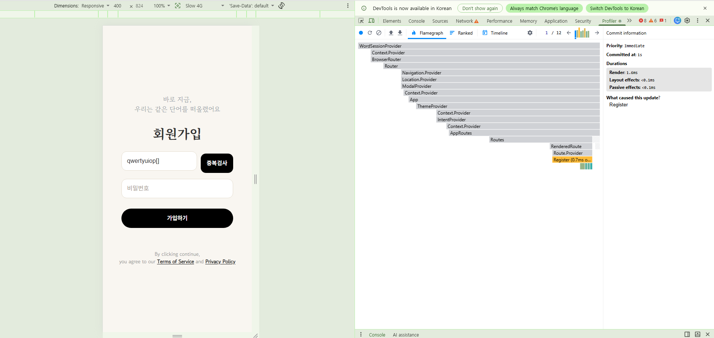
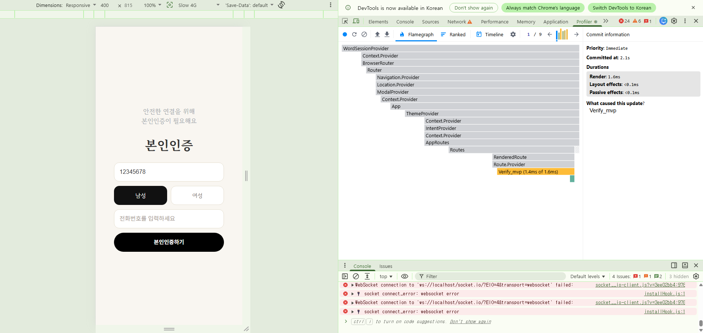

# S2. 폼 타이핑당 리렌더

> 측정 환경·원칙은 [README](../README.md) 참조.
> ⚠️ 이 시나리오만 **dev 서버(`localhost:5179`)** 에서 측정한다.
> 프로덕션 빌드는 프로파일링 정보가 제거되어 React DevTools Profiler 가 동작하지 않는다.
> **리렌더 "횟수"는 dev·prod 가 동일**하므로 측정값은 유효하고, 시간 값만 참고용으로 본다.

## 대상 문제

모든 폼이 **제어 컴포넌트(controlled component)** 다. 입력값을 `useState` 로 들고 있어
글자를 칠 때마다 상태가 바뀌고, 그때마다 컴포넌트가 리렌더된다.

```
사용자가 'a' 입력
  → onChange → setUsername('a')
  → 상태 변경 → 컴포넌트 전체 리렌더
  → 자식(입력창·버튼·모달 등) 다시 계산
```

[`Register.tsx:116`](../../../telepathy-front/src/pages/Register.tsx)
```tsx
onChange={(e) => setUsername(e.target.value)}
```

`useState` / `onChange` 를 쓰는 폼은 다음과 같다.

| 파일 | useState | onChange |
|---|---|---|
| `Verify_mvp.tsx` | 9 | 3 |
| `Register.tsx` | 5 | 2 |
| `FindPassword.tsx` | 6 | 4 |
| `WordSetForm.tsx` | 6 | 3 |
| `ChangePassword.tsx` | 5 | 3 |
| `LoginPage.tsx` | 4 | 2 |

## 측정 방법

```
1. localhost:5179/{경로} 접속          ← dev 서버
2. Profiler ⚙️ → "Record why each component rendered" 체크
3. 🔵 녹화 시작 → 입력창에 N글자 타이핑 → 🔴 중지
4. 상단 막대그래프의 commit 수 확인
```

폼 크기에 따른 차이를 보기 위해 **가장 가벼운 폼(Register, 상태 5개)** 과
**가장 무거운 폼(Verify_mvp, 상태 9개)** 을 비교했다.

> Verify_mvp 는 인증번호 발송 후 3분 카운트다운(`timeLeft`)이 1초마다 상태를 바꾸므로,
> **발송 버튼을 누르지 않은 상태**에서 측정해 타이핑 기여분만 분리했다.
> (SMS 실제 발송 비용·발송 제한도 회피)

## 결과 (Before)

### Register (`/register`) — 상태 5개

| 회차 | 입력 글자 | commit | 글자당 | Render (1 commit) |
|---|---|---|---|---|
| 1 | 12 | **12** | 1.0 | 3.8 ms (Register 2.3 ms) |
| 2 | 12 | **12** | 1.0 | 1.6 ms (Register 0.7 ms) |



### Verify_mvp (`/verify-mvp`) — 상태 9개

| 입력 | commit | 내역 | Render (1 commit) |
|---|---|---|---|
| 8글자 + 성별 버튼 1회 | **9** | 타이핑 8 + 클릭 1 | 1.6 ms (Verify_mvp 1.4 ms) |



## 결과 (After)

React Hook Form 전환 후 재측정. 조건은 Before 와 동일(dev 서버 5179, `/register`, 12글자).

> ⚠️ **측정 도구가 Before 와 다르다.** Before 는 React DevTools **Profiler UI** 의 commit 막대를 읽었으나,
> After 는 **`useEffect`(의존성 배열 없음) 기반 commit 계측**으로 측정했다.
> `useEffect(no-dep)` 는 commit 마다 정확히 1회 실행되므로 Profiler 가 세는 commit 수와 동일하다.
> 도구를 바꾼 이유: 이 측정은 브라우저 자동화로 수행했는데, **DevTools Profiler 패널은 페이지와 분리된
> 컨텍스트라 자동화로 Record 버튼·commit 막대에 접근할 수 없다.** 세는 대상(commit 수)은 같다.
>
> StrictMode 주의: dev StrictMode 는 렌더 함수를 2회 호출하므로 **렌더 함수 진입 시점 카운트는 2배로 오염된다.**
> `useEffect` 는 commit 단계에서 실행되고 **업데이트 commit 에는 StrictMode 이중 실행이 없어** 오염되지 않는다.
> (mount 만 effect 가 2회 실행되어 기준선이 2로 잡히며, 이후 delta 가 실제 commit 수다.)

### Register (`/register`) — 12글자

| 필드 | 입력 | 타이핑이 유발한 commit | 글자당 |
|---|---|---|---|
| **비밀번호** (순수 RHF) | 12자 | **0** | **0.0** |
| 아이디 (부수효과 있음) | 12자 | **1** (1회성, 글자수 무관) | ≈0.08 |

**순수 RHF 비용은 비밀번호 필드에서 측정한 `0 commit` 이다.** 비밀번호 입력창은 `register('password')`
외에 부수효과가 없어, 타이핑 → 리렌더 경로가 완전히 끊긴 상태를 그대로 보여준다.
12번의 실제 `input` 이벤트를 발생시켜도 commit 카운터는 움직이지 않았다(2 → 2).

아이디 필드의 `+1` 은 **글자당이 아니라 1회성**이다. 첫 키 입력 시 `register` 규칙의
`onChange`(`setIsAvailable(null)` + `clearErrors('username')`)가 formState 를 한 번 알리며 발생하고,
이후 글자에는 변화가 없어 추가 commit 이 없다. 18글자까지 입력해도 `+1` 로 동일했다.
→ 이 비용은 **RHF 가 아니라 중복검사 무효화 로직** 때문이며, 글자 수에 비례하지 않는다.

## 핵심 지표

| 지표 | Before | After | 개선 |
|---|---|---|---|
| **글자당 리렌더 (순수 RHF, 비밀번호)** | **1.0회** | **0.0회** | **-100%** |
| **12글자 입력 시 총 commit** | **12회** | **0회** | **-12** |
| 부수효과 필드(아이디) 타이핑 비용 | 12회 (글자당 1) | 1회 (1회성) | -11 |
| 리렌더 범위 | 해당 폼 컴포넌트만 | 변화 없음(타이핑 시 리렌더 자체가 없음) | — |
| 1 commit Render (dev) | 1.6~3.8 ms | 타이핑 중 commit 없음 → 측정 대상 소멸 | — |

> Verify_mvp 는 이번 전환 범위(인증 폼 4종: ChangePassword·LoginPage·Register·FindPassword)에
> 포함되지 않아 After 를 측정하지 않았다. Register 로 대표 측정한다.

## 분석

**① 글자당 정확히 1회 리렌더 — 결정적으로 재현된다.**
Register 2회 측정 모두 `12글자 → 12 commit`. Verify_mvp 도 `8글자 → 8 commit`(+버튼 1).
Profiler 의 **"What caused this update?"** 가 각각 `Register`, `Verify_mvp` 로 표시되어,
원인이 해당 컴포넌트의 상태 변경임이 추정이 아니라 **React 가 알려준 사실**로 확인됐다.

**② 폼 크기와 리렌더 횟수는 무관했다 — 예상과 달랐다.**
"상태가 많은 폼일수록 부담이 클 것"으로 예상했으나, 상태 5개와 9개 폼이
**동일하게 글자당 1회**였다. 리렌더 비용은 상태 개수가 아니라
**컴포넌트 트리 크기**에 좌우되며, 두 폼 모두 트리가 작기 때문이다.

**③ Context 연쇄 리렌더는 없다.**
flame graph 상 렌더 경로는 18단계로 깊다.

```
WordSessionProvider → Context.Provider → BrowserRouter → Router
→ Navigation.Provider → Location.Provider → ModalProvider → Context.Provider
→ App → ThemeProvider → Context.Provider → IntentProvider → Context.Provider
→ AppRoutes → Routes → RenderedRoute → Route.Provider → [폼 컴포넌트]
```

그러나 **주황색으로 강조된 것은 폼 컴포넌트 하나뿐**이고 상위 Provider 는 전부 회색이다.
즉 상위가 함께 리렌더되지 않는다. → **S3(Zustand) 도입 근거가 약해질 수 있는 관찰**이며,
S3 측정에서 확인할 지점이다.

**④ 현재 사용자 체감은 문제없다.**
1 commit 당 Render 가 dev 기준 1.6~3.8 ms 로, 60fps 예산(16.7 ms) 안에 넉넉히 들어온다.
prod 는 더 빠르다. **지금 타이핑이 버벅이지는 않는다.**

따라서 React Hook Form 의 가치는 "현재 느린 것을 고친다"가 아니라
**"폼이 커지거나 자식이 무거워져도 리렌더가 늘지 않는 구조"** 에 있다.
이 점을 과장하지 않고 기록한다.

## 개선 방향

React Hook Form 으로 **비제어 컴포넌트(uncontrolled)** 전환.

| | 제어 (현재) | 비제어 (RHF) |
|---|---|---|
| 값 보관처 | React `useState` | **DOM 자체** |
| 타이핑 시 | 매 글자 상태 변경 → 리렌더 | **리렌더 없음** |
| 값 읽는 시점 | 항상 최신 | 제출 시 (`ref` 로) |

RHF 는 `ref` 로 DOM 입력값을 추적해 **타이핑 중에는 React 를 건드리지 않는다.**
따라서 글자당 리렌더가 0 에 수렴한다.

부가 효과로 검증 로직(필수값·형식·에러 메시지)이 선언적으로 정리된다.
현재는 각 폼이 `useState` 와 조건문으로 직접 처리하고 있다.

### After 측정 시 주의

- 반드시 **같은 글자 수**로 측정한다 (Register 12글자 기준)
- **dev 서버(5179)** 에서 측정한다
- 타이핑 속도가 빠르면 React 가 입력을 배치로 묶어 commit 이 줄어드니
  천천히 또박또박 입력한다

## 결론 (검증됨)

예측대로 **글자당 리렌더가 0 으로 확인됐다.** 순수 RHF 필드(비밀번호)는 12글자 입력에
commit 이 한 번도 발생하지 않았다(Before 12회 → After 0회).

다만 S2 분석 ④에서 적었듯 **Before 도 이미 60fps 예산 안(1.6~3.8 ms)이라 체감 문제는 없었다.**
따라서 이 결과는 "느리던 것을 빠르게 했다"가 아니라, **"타이핑이 React 리렌더 경로에서
완전히 분리됐다"** 는 구조 변화로 읽어야 한다. 폼에 무거운 자식이 붙거나 필드가 늘어도
타이핑 비용이 증가하지 않는다는 것이 실측으로 확보한 값이다.

측정 재현 방법(자동화 환경):

```js
// 비밀번호 입력창(부수효과 없는 순수 RHF 필드)에 실제 input 이벤트 12회 발생
const pw = document.querySelector('input[placeholder="비밀번호"]');
pw.focus();
const before = window.__commits;              // useEffect(no-dep) 계측 카운터
const setter = Object.getOwnPropertyDescriptor(HTMLInputElement.prototype, 'value').set;
const s = 'Passw0rd!xyz';                       // 12자
for (let i = 1; i <= s.length; i++) {
  setter.call(pw, s.slice(0, i));
  pw.dispatchEvent(new InputEvent('input', { bubbles: true, data: s[i - 1], inputType: 'insertText' }));
}
// after - before === 0  → 타이핑이 유발한 commit 0
```
