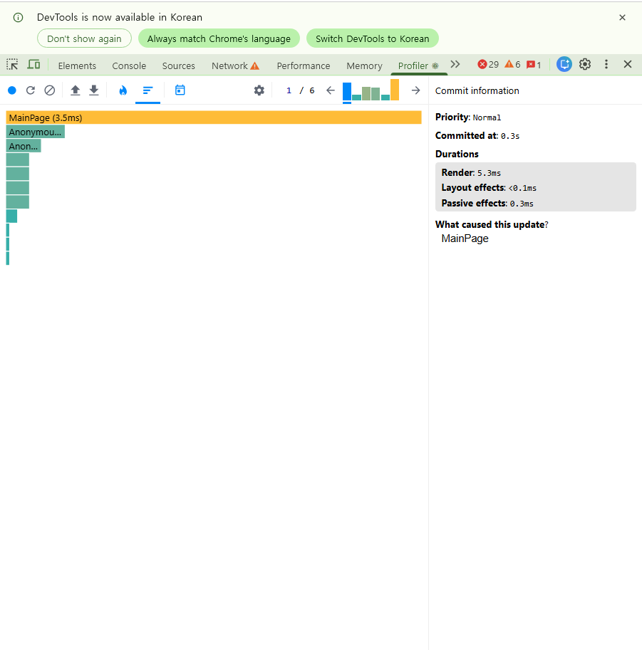
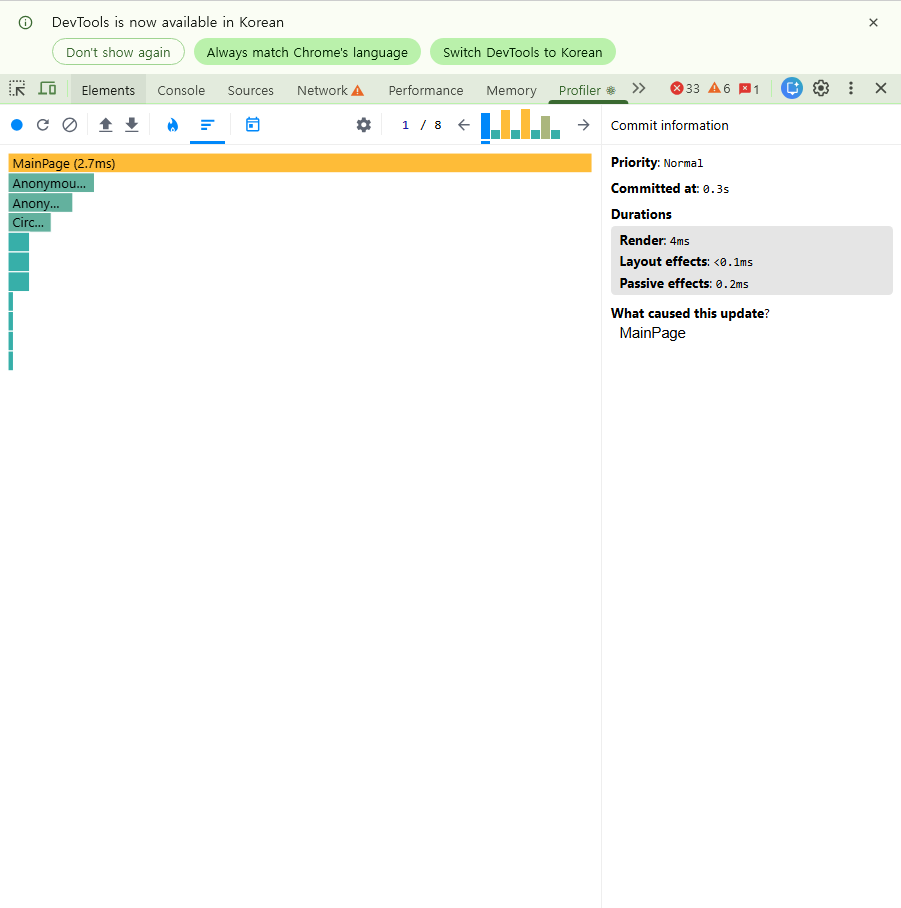
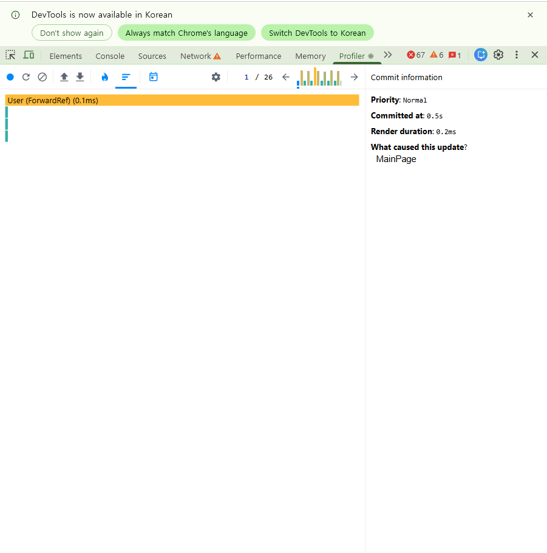

# S3. Context 리렌더 전파

> 측정 환경·원칙은 [README](../README.md) 참조.
> ⚠️ [S2](../s2-form-rerender/README.md) 와 마찬가지로 **dev 서버(`localhost:5179`)** 에서 측정한다.

## 목적

**Zustand 를 도입할지 판단하기 위한 측정이다.**
도입 여부를 정하는 것이 목표이므로, "개선폭 측정"이 아니라 **"문제가 존재하는가"** 를 확인한다.

## 대상 문제 (가설)

4개 Context 모두 `value` 를 **인라인 객체 리터럴**로 만들고 `useMemo` 가 없다.

| Context | value | 소비처 |
|---|---|---|
| `WordSessionContext` | `{{ ...session, setProfile, startSession, endSession }}` | ChatPage, MainPage, MyPage |
| `IntentContext` | `{{ intent, setIntent }}` | **0곳** |
| `ModalContext` | `{{ isOpen, setIsOpen }}` | ModalPolicy, LoginPage |
| `ThemeContext` | `{{ theme, setTheme }}` | App |

React 는 Context 값 변경을 `Object.is` 로 판단한다. 렌더마다 새 객체가 생성되면
내용이 같아도 참조가 달라 **모든 consumer 가 리렌더**된다.

```
Provider 리렌더 → 새 value 객체 → 내용이 같아도 → 전 consumer 리렌더
```

`WordSessionProvider` 는 최상위(`main.tsx`)라, 발현되면 앱 전체 트리가 영향받는다.

## 측정 방법

```
1. localhost:5179/main 접속
2. Profiler ⚙️ → "Record why each component rendered" 확인
3. [A] 🔵 녹화 → 단어 클릭 → 🔴 중지
4. [B] 🔵 녹화 → 아무 조작 없이 10초 대기 → 🔴 중지   ← 타이머 기여분 분리
5. 각 commit 의 "What caused this update?" 와 Ranked 목록 확인
```

`WordSessionProvider` 가 원인으로 나오는지, 다른 Context 소비처가 함께 렌더되는지가 판정 기준이다.

## 결과

### [A] 단어 클릭

| 회차 | commit | 최상위 (Ranked) | Render | 원인 |
|---|---|---|---|---|
| 1 | 6 | `MainPage` 3.5 ms | 5.3 ms | **MainPage** |
| 2 | 8 | `MainPage` 2.7 ms | 4.0 ms | **MainPage** |




### [B] 무조작 10초 ⭐

| 조작 | commit | 원인 | Priority | Render |
|---|---|---|---|---|
| **없음** | **26** | **MainPage** | `Normal` | 0.2 ms |



## 핵심 지표

| 지표 | 값 | 판정 |
|---|---|---|
| `WordSessionProvider` 가 원인인 commit | **0건** | Context 전파 없음 |
| 다른 Context 소비처(ChatPage·MyPage) 리렌더 | **0건** | 연쇄 없음 |
| **무조작 10초 commit** | **26회 (초당 ≈2.6)** | ⚠️ 타이머 리렌더 |
| 1 commit Render | 0.2 ms | 체감 문제 없음 |

## 분석

**① Context 연쇄 리렌더는 발생하지 않는다 — 가설 기각.**

모든 commit 에서 "What caused this update?" 가 **`MainPage`** 였다.
`WordSessionProvider` 는 단 한 번도 원인으로 나오지 않았고, Ranked 목록에도
`MainPage` 서브트리만 있을 뿐 `ChatPage`·`MyPage` 는 없었다.

이유는 **React 의 리렌더가 아래로만 전파**되기 때문이다.

```
MainPage 의 상태 변경
  → MainPage 만 리렌더 (Provider 는 상위에 있어 영향 없음)
  → Provider 리렌더 X → value 객체 그대로 → consumer 리렌더 X
```

`useMemo` 누락은 사실이지만, **Provider 자신이 리렌더될 때만** 문제가 발현된다.
`WordSessionProvider` 의 `session` 은 매칭 시작/종료 때만 바뀌므로 빈도가 매우 낮고,
그때는 화면이 전환되므로 리렌더가 정상 동작이다.

**② 대신 다른 문제를 발견했다 — MainPage 타이머 리렌더.**

조작이 전혀 없는 10초 동안 **commit 26회**가 발생했다. `Priority: Normal` 은
사용자 입력(`Immediate`)이 아니라 **타이머 기반 업데이트**임을 뜻한다.

MainPage 에는 `setInterval` 이 3개 있고, 그중 둘이 **같은 상태(`remaining`)를 1초마다 건드린다.**

| 위치 | 주기 | 하는 일 |
|---|---|---|
| [`MainPage.tsx:415`](../../../telepathy-front/src/pages/MainPage.tsx) | 1초 | `syncFromServer` → 서버 시간으로 `setRemaining` |
| [`MainPage.tsx:422`](../../../telepathy-front/src/pages/MainPage.tsx) | 1초 | `tick` → 로컬 카운트다운 `setRemaining` |
| [`MainPage.tsx:242`](../../../telepathy-front/src/pages/MainPage.tsx) | 10초 | `checkTime` → 운영시간 확인 |

1초 주기 타이머 **2개가 중복**으로 같은 값을 갱신하는 구조라, 예상(초당 1회)의
2배 이상인 **초당 2.6회**가 나온 것으로 보인다.

**③ [S6](../s6-polling/README.md) 와 같은 원인의 다른 측면이다.**

```
MainPage 타이머
  ├─ 네트워크 측면 (S6): API 요청 59건/분
  └─ 렌더링 측면 (S3): 리렌더 약 156회/분
```

폴링 구조를 고치면 **두 문제가 함께 해결**된다.

**④ 현재 체감 문제는 없다.**

1 commit 당 Render 가 0.2 ms 로, 60fps 예산(16.7 ms)의 약 1% 다.
지금 사용자가 버벅임을 느끼지는 않는다. 문제는 속도가 아니라
**조작이 없는데도 상시 CPU·배터리를 소모하는 구조적 낭비**이며,
MainPage 에 컴포넌트가 늘면 비용이 선형 증가한다는 점이다.

## 결론 — Zustand 도입하지 않음

| 판단 근거 | |
|---|---|
| Context 연쇄 리렌더 | 측정 결과 **미발생** |
| 전역 상태 규모 | 서버 데이터를 TanStack Query 가 가져가면 더 줄어듦 |
| `useMemo` 누락 | 사실이나 **현재 발현되지 않음** |

**측정 결과 문제가 존재하지 않아 도입하지 않는다.**
라이브러리를 추가하지 않는 것도 유효한 결론이며,
이는 [README](../README.md) 에 미리 정해둔 판단 기준을 따른 것이다.

### 단, 남겨둘 개선 후보 (Zustand 와 무관)

| 항목 | 내용 |
|---|---|
| **MainPage 타이머 정리** ⭐ | 1초 타이머 2개가 같은 상태를 중복 갱신. S6 와 함께 해결 |
| Context `value` 메모이제이션 | `useMemo` 로 감싸두면 향후 Provider 리렌더 시 안전. 저비용 예방 |
| `IntentContext` 제거 검토 | **소비처 0곳** — 사용되지 않는 Context |

Context 를 계속 쓰더라도 `value` 를 `useMemo` 로 감싸는 것만으로
Zustand 도입 없이 동일한 안전성을 확보할 수 있다.
