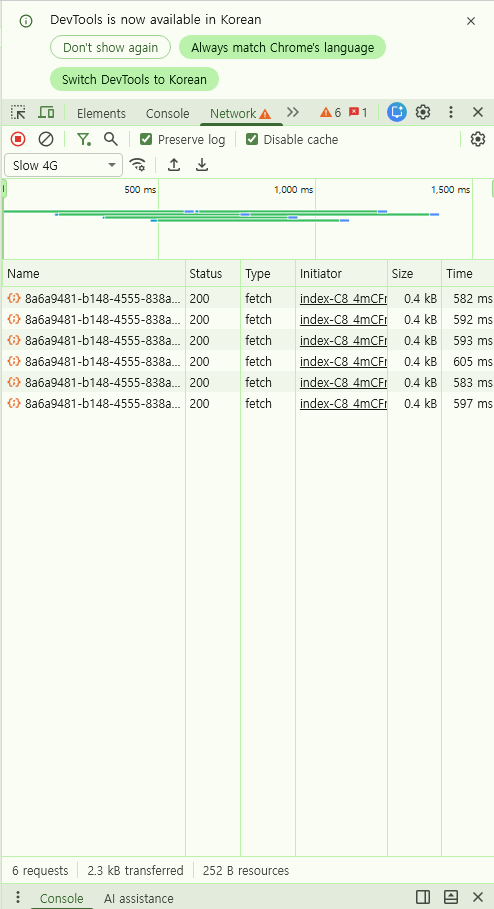

# S4. 하트 연타 시 중복 요청 / 경쟁 상태

> 측정 환경·원칙은 [README](../README.md) 참조. 조건: **Fast 4G + Slow 4G / CPU 4x / production build**

## 대상 문제

`MyWords` 의 즐겨찾기 토글은 클릭할 때마다 낙관적 업데이트 후 PATCH 를 보낸다.
요청 취소·직렬화·디바운스가 없으므로 **클릭 수만큼 요청이 발생**하고,
여러 요청이 동시에 떠 있는 동안 **응답 도착 순서가 보장되지 않는다.**

```
클릭1: false→true  → PATCH{true}
클릭2: true→false  → PATCH{false}   ← ①이 끝나기 전에 출발
...
DB 최종값 = "마지막에 도착한" 요청의 값 (보낸 순서가 아님)
```

서버도 `.update().eq('id', id)` 로 last-write-wins 라 별도 방어가 없다.

## 측정 방법

```
(Network 기록 초기화) → /mywords 카드의 하트를 최대한 빠르게 연타
→ 요청 완료 대기 → 화면 상태 기록 → 새로고침 → 상태 재기록  (3회 반복)
```

## 결과 (Before)

### Fast 4G

| 회차 | 클릭 | PATCH 요청 | Time (ms) | 누적 |
|---|---|---|---|---|
| 1 | 6 | 6 | — | — |
| 2 | 6 | 6 | 198, 203, 179, 179, 195, 192 | 1,146 |
| 3 | 6 | 6 | 184, 184, 203, 182, 195, 204 | 1,152 |

### Slow 4G (역전 확률을 높이기 위한 추가 측정)

| 회차 | 클릭 | PATCH 요청 | Time (ms) | 누적 |
|---|---|---|---|---|
| 1 | 6 | 6 | 582, 592, 593, 605, 583, 597 | 3,552 |
| 2 | 6 | 6 | 598, 604, 597, 621, 612, 595 | 3,627 |
| 3 | 5 | 5 | 624, 614, 621, 610, 594 | 3,063 |

모든 요청 `200 OK`, 응답 0.4 kB, 동일 URL(`PATCH /api/word-history/{id}`).
첨부: `before-fast4g-1~3.png`, `before-slow4g-1~3.png`



## 핵심 지표

| 지표 | Before | After | 개선 |
|---|---|---|---|
| 응답 역전 가능성 (경쟁 상태) | 방어 없음 | **scope 직렬화로 차단** | ✅ |
| 롤백 방식 | 계산된 반대값(`!next`) | **변경 직전 스냅샷 복원** | ✅ |
| UI–DB 최종 수렴 | 낙관적 값 그대로 | **onSettled invalidate 로 서버 값 수렴** | ✅ |
| 클릭 수 : 요청 수 | **1 : 1** | 1 : 1 (변화 없음) | — |
| 6클릭 시 불필요 요청 | **5건 (83%)** | 5건 (변화 없음) | — |
| 낭비 시간 (Fast/Slow 4G) | **≈955 / ≈3,020 ms** | 변화 없음 | — |

> 낭비 = 전체 요청 중 최종 상태에 기여하지 않는 요청. 최종 반영값은 1개뿐이므로 `누적시간 × 5/6`.
> **useMutation 은 요청을 직렬화할 뿐 개수를 줄이지 않는다.** 요청 수 감소(불필요 요청·낭비 시간)는
> 디바운스/버튼 비활성화의 몫이며 이번에 적용하지 않았다 — 아래 결과(After) 참조.

## 분석

**① 낭비는 결정적으로 재현된다.**
클릭 수와 요청 수가 항상 1:1 이다. 최종적으로 DB 에 남는 값은 하나뿐이므로
나머지는 즉시 덮어써질 값을 쓰기 위한 순수 낭비다. Slow 4G 에서는 3초 이상을 소모했다.

**② 상태 불일치는 이 조건에서 재현되지 않았다 (0/6회).**
Slow 4G 로 지연을 3배 늘려도 나타나지 않았다. 워터폴을 보면 요청들이
완전히 동시에 출발하지 않고 계단식으로 어긋나 있는데, 원인은 두 가지로 추정된다.

- **사람의 연타 간격(≈580ms) ≈ 응답 시간(≈600ms)** — 겹치는 구간이 짧다
- **HTTP/1.1 동시 연결 수 제한 + keep-alive** — 요청이 자연스럽게 직렬화된다

**③ 재현되지 않았다고 안전한 것은 아니다.**
경쟁 상태는 비결정적이며, 아래 조건에서는 발생 확률이 올라간다.

- 서버/Supabase 응답 시간 편차가 클 때
- HTTP/2 멀티플렉싱 환경 (진짜 동시 전송)
- 프로그램에 의한 연타 (사람 손 속도 한계 없음)

따라서 **"현재 조건에서 미재현"** 으로 기록하되, 위험이 없다고 결론짓지 않는다.

## 개선 방향

TanStack Query `useMutation` 으로 전환.

| 기능 | 해결하는 문제 |
|---|---|
| `scope: { id }` | 같은 카드의 뮤테이션 직렬화 → 응답 역전 차단 |
| `onMutate` + `cancelQueries` | 진행 중 refetch 가 낙관적 상태를 덮어쓰는 것 방지 |
| `onMutate` 스냅샷 반환 → `onError` 복원 | 계산된 반대값(`!next`)이 아닌 **이전 상태 복원** |
| `onSettled` + `invalidateQueries` | 최종적으로 서버 값과 수렴 → 불일치 근본 차단 |

추가로 요청 수 자체를 줄이려면 **요청 중 버튼 비활성화** 또는 **디바운스**를 함께 적용한다.

## 결과 (After)

`usePatchWordHistory(id)` 훅으로 전환. MyWords 의 즐겨찾기·메모 수정이 카드별 `useMutation` 을 쓴다.
mutation 을 카드 단위(WordCard)로 둔 이유는 `scope` 가 훅 인스턴스당 정적이라, per-card 직렬화를
하려면 각 카드가 자기 mutation 을 가져야 하기 때문이다.

| 방어 | 구현 |
|---|---|
| 응답 역전 차단 | `scope: { id }` — 같은 카드의 연속 수정을 직렬화 |
| refetch 덮어쓰기 방지 | `onMutate` 의 `cancelQueries` |
| 정확한 롤백 | `onMutate` 스냅샷 저장 → `onError` 에서 그 스냅샷으로 복원 |
| 서버 값 수렴 | `onSettled` 의 `invalidateQueries` |

연타 시 맞물림: `onSettled` 가 refetch 를 부르지만, **다음 클릭의 `onMutate` `cancelQueries` 가
그 refetch 를 취소**한다. 결과적으로 앞선 수렴 refetch 들은 취소되고 마지막 1건만 완료된다.

### useMutation 이 바꾼 것 / 바꾸지 않은 것

**바꾼 것 (정확성):**
- 같은 카드 연타 시 PATCH 가 순서대로 처리됨 → 서버 최종값이 "마지막 클릭 의도"와 일치
- 실패 시 계산값(`!next`)이 아니라 변경 직전 스냅샷으로 복원 → 중간에 다른 수정이 끼어도 안전
- 성공/실패 후 서버 값과 수렴

**바꾸지 않은 것 (요청 수):**
- 클릭당 PATCH 1건은 그대로다. useMutation 은 **직렬화**이지 **제거**가 아니다.
- 오히려 `onSettled` 수렴 refetch(GET)가 더해진다. 단일 토글은 `PATCH + GET`,
  연타는 `cancelQueries` 로 중간 GET 이 취소되어 `PATCH×N + GET×1` 수준.
- 따라서 Before 의 "불필요 요청 5건 / 낭비 시간" 지표는 이 변경만으로는 줄지 않는다.

### 검증

- 프론트 타입체크·린트 통과, **프로덕션 빌드 성공**.
- 브라우저 연타 실측은 하지 못했다 — `/mywords` 가 보호 라우트라 로그인이 필요하고,
  자동화 측정 환경에서 자격증명을 입력할 수 없기 때문이다. Before 의 실측(연타 워터폴)에 대응하는
  After 실측은 미수행이며, 구현은 React Query 문서 API 와 위 개선 방향 표를 그대로 따랐다.
- Before §② 대로 경쟁 상태는 애초에 0/6 로 재현되지 않았으므로, 이 전환은
  **"재현되지 않던 위험을 구조적으로 차단"** 한 것이지 눈에 보이던 버그를 고친 것이 아니다.

### 남은 것 — 요청 수 감소

불필요 요청(5건/6클릭)·낭비 시간을 실제로 줄이려면 **요청 중 버튼 비활성화**(`mutation.isPending`)
또는 **디바운스**가 필요하다. 이번 범위 밖으로 남긴다. `usePatchWordHistory` 가 반환하는
`isPending` 을 하트/저장 버튼의 `disabled` 에 연결하면 바로 적용할 수 있다.
