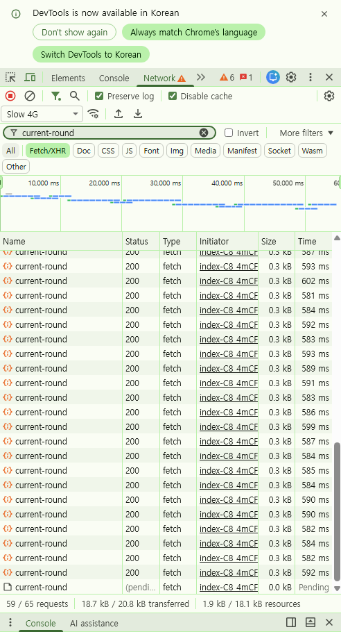
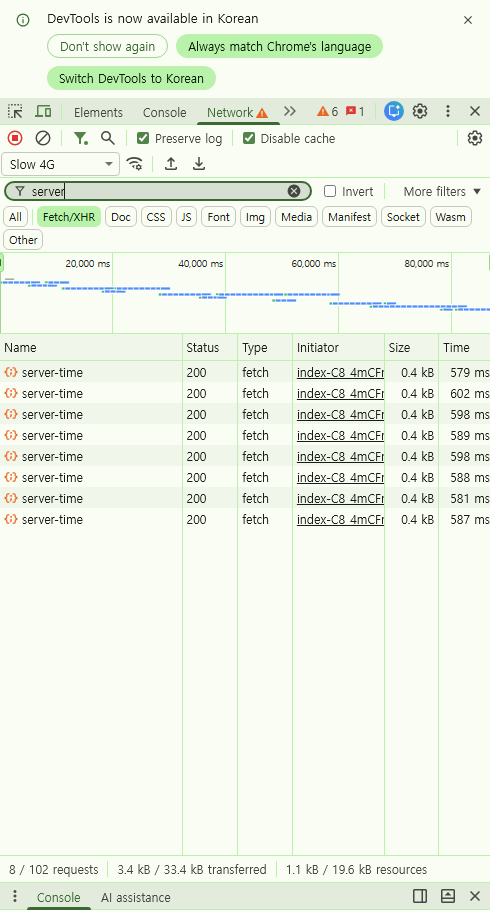
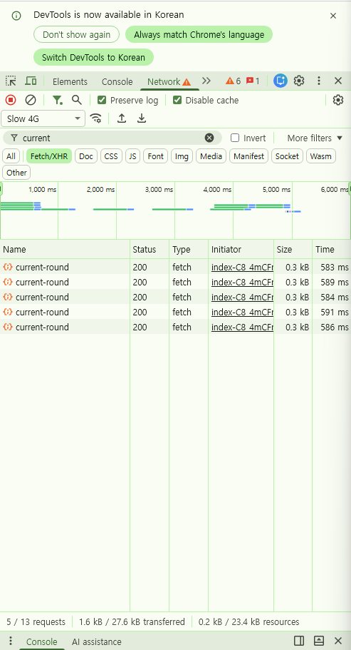

# S6. MainPage 폴링 요청량

> 측정 환경·원칙은 [README](../README.md) 참조. 조건: **Slow 4G / CPU 4x / production build**

## 대상 문제

`MainPage` 는 15초 라운드의 남은 시간을 서버와 맞추기 위해 **1초마다** 폴링한다.

[`MainPage.tsx:415`](../../telepathy-front/src/pages/MainPage.tsx)
```ts
const syncInterval = setInterval(syncFromServer, 1000);   // → /api/match/current-round
```

`MainPage.tsx:242` 에는 10초 주기 `/api/server-time` 폴링도 있다.

### S1·S4 와 성격이 다르다

| | 유발 원인 | 요청 수를 결정하는 것 |
|---|---|---|
| S1 중복 호출 | 사용자가 화면 이동 | 이동 횟수 |
| S4 연타 | 사용자가 클릭 | 클릭 횟수 |
| **S6 폴링** | **아무것도 하지 않아도** | **머문 시간** |

S1·S4 는 사용자 행동에 비례하지만, S6 는 **가만히 있어도 시간에 비례해 증가**하며 상한이 없다.
그리고 `/main` 은 단어를 고르고 매칭을 기다리는, **가장 오래 머무는 화면**이다.

## 측정 방법

```
1. /main 진입, 로드 완료 대기
2. Network 기록 초기화
3. 아무 조작 없이 60초 대기        → [A] 포그라운드
4. 기록 초기화 후 다른 탭으로 전환
5. 60초 대기 후 복귀               → [B] 백그라운드
```

## 결과 (Before)

| 폴링 | 주기 | [A] 포그라운드 60초 | [B] 백그라운드 60초 |
|---|---|---|---|
| `current-round` | 1초 | **59건** | **0건** |
| `server-time` | 10초 | **8건** (약 80초 구간) | **0건** |

`current-round` 각 요청: `200 OK`, 0.3 kB, **581~602 ms**
전송량: **18.7 kB / 분**

### [A] 포그라운드 — `current-round` 59건 / 60초



워터폴이 60초 내내 빈틈없이 이어진다. 마지막 요청은 `(pending)` 상태로,
이전 요청이 끝나기 전에 다음이 발사되는 구간이 존재함을 보여준다.

### [A] 포그라운드 — `server-time` 8건



### [B] 백그라운드 — 전환 직후 5건만 마무리되고 중단



타임라인이 6,000 ms 에서 끝난다. 탭 전환 시점에 이미 떠 있던 요청들이
마무리된 것일 뿐, **이후 60초 동안 신규 요청은 발생하지 않았다.**

## 핵심 지표

| 지표 | Before | After | 개선 |
|---|---|---|---|
| `current-round` 요청 / 분 | **59건** | | |
| 전송량 / 분 | **18.7 kB** | | |
| 요청 발사 간격 : 응답 시간 | **1,000 ms : 587 ms** | | |
| 백그라운드 요청 / 분 | **0건** (개선 여지 없음) | | |

### 확장 시 추정

```
사용자   1명 ·  1분  →     59 요청 /  18.7 kB
사용자 100명 ·  1분  →  5,900 요청 /   1.9 MB
사용자 100명 · 10분  → 59,000 요청 /    19 MB
```

응답이 0.3 kB 로 작아도 **요청 건수 자체가 부담**이며, 요청마다 Supabase 왕복이 따라온다.

## 분석

**① 포그라운드 폴링량은 확인된 낭비다.**
15초 라운드의 잔여 시간을 맞추는 데 초당 1회는 과하다. 라운드가 15초이므로
동기화 주기를 늘려도 사용자 체감에는 거의 영향이 없다.

**② 요청 겹침 위험 — 더 중요한 발견.**

```
발사 간격 1,000 ms  vs  응답 시간 587 ms  →  여유 413 ms
```

`setInterval` 은 **이전 요청의 완료 여부와 무관하게** 정해진 간격마다 발사한다.
응답이 1초를 넘기면 이전 요청이 끝나기 전에 다음이 나가 요청이 누적된다.
실제로 측정 중 마지막 요청이 `(pending)` 상태로 관찰됐고, Slow 4G 에서 이미 여유가 크지 않다.

**③ 백그라운드 낭비는 발생하지 않았다 — 개선 대상에서 제외.**
당초 "탭이 비활성이어도 계속 요청할 것"으로 예상했으나, 측정 결과 **두 폴링 모두 0건**이었다.
Chrome 이 비활성 탭의 타이머를 억제(throttling)하기 때문이다.

→ 따라서 `refetchIntervalInBackground: false` 류의 옵션은 **이 프로젝트에서 개선 근거가 되지 않는다.**
이미 브라우저가 처리하고 있는 것을 개선했다고 기록하지 않는다.

## 개선 방향

백그라운드 중단이 아니라 **포그라운드 요청량과 겹침**을 겨냥한다.

| 방식 | 내용 | 평가 |
|---|---|---|
| **주기 조정** | 1초 → 3~5초 | 가장 간단. 15초 라운드엔 충분 |
| **완료 후 대기** | `setInterval` → `setTimeout` 재귀 | 요청 겹침 구조적 차단 |
| **TanStack Query** | `refetchInterval` + 중복 요청 제거 | 여러 컴포넌트가 같은 데이터를 봐도 요청 1개 |
| **소켓 push 전환** ⭐ | 서버가 라운드 전환 시 emit | **폴링 자체가 사라짐**. 이미 Socket.IO 사용 중이라 자연스러움 |

근본 해결은 소켓 전환이지만 TEL-6 마이그레이션 범위와 겹치므로,
우선 주기 조정 + 겹침 방지로 개선폭을 측정한다.
